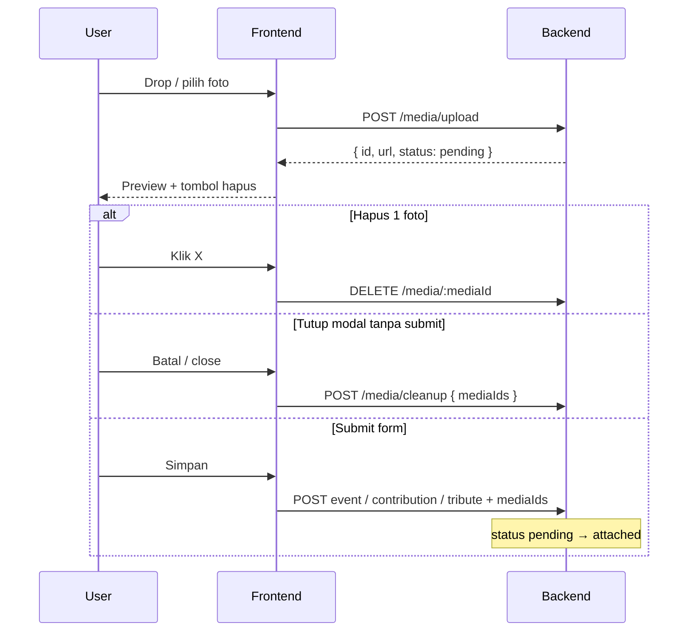

# Media Upload API — Events & In Memoriam

Spesifikasi API upload foto untuk modul **Acara (Events)** dan **In Memoriam**.  
Dokumen ini untuk tim **Backend** (atau AI BE) mengimplementasikan endpoint yang akan dikonsumsi FE.

**Base URL (dev):** `http://localhost:3000`  
**Prefix API:** `/api/v1`  
**Auth:** Bearer JWT (wajib di semua endpoint media)  
**Perspektif:** resolve via `resolveReadFocusMiddleware` (sama Persons/Events/Memoriam) — **tidak wajib** kirim `?focusPersonId=`. Cukup PATCH `readFocusPersonId` saat toggle navbar; override opsional via query.

Related docs:

- [`MAP-EVENTS-MEMORIAM-API.md`](./MAP-EVENTS-MEMORIAM-API.md) — CRUD events, contributions, tributes (sudah menerima `photoUrls`)
- [`FE-API-INTEGRATION.md`](../../guides/FE-API-INTEGRATION.md) — kontrak response & auth FE

---

## 1. Masalah yang diselesaikan

Saat ini FE (`ImageDropzone`) masih mengubah file jadi **base64 / object URL lokal**. Itu tidak scalable dan tidak bisa di-share.

Yang dibutuhkan:

1. User **drag & drop / pilih file** → langsung upload ke server (eager upload), **jangan tunggu submit form**.
2. Setelah preview muncul, user bisa **hapus 1 foto** kalau salah upload → hit DELETE.
3. User **tutup / batal modal** tanpa submit → hapus semua foto yang baru di-upload di sesi itu (orphan cleanup).
4. User **submit form** → foto yang tersisa di-attach ke event / contribution / tribute.

Ada **2 modul** (3 surface UI) yang pakai flow yang sama:

| Purpose (`purpose`) | Modul | UI FE | Max foto |
|---------------------|-------|-------|----------|
| `event` | Events | Create / Edit Event (`EventFormModal`) | 10 |
| `event_contribution` | Events | Contribute Photo (`ContributePhotoModal`) | 10 |
| `memoriam_tribute` | Memoriam | Tulis Kenangan (`AddTributeModal`) | 8 |

---

## 2. Keputusan produk (v1)

| Topik | Keputusan |
|-------|-----------|
| Timing upload | **Eager** — upload saat file masuk dropzone, bukan saat submit |
| Model media | Draft/pending dulu; baru **attached** saat form di-submit |
| Unit upload | **1 file per request** (FE boleh parallel beberapa request) |
| Cleanup modal close | FE panggil batch cleanup; BE juga sebaiknya punya TTL job |
| Attach ke entity | Prefer kirim `mediaIds[]` (Opsi B); fallback `photoUrls[]` (Opsi A) tetap didukung kalau BE validate URL milik storage kita |
| Akses | Hanya uploader yang boleh delete media `pending` miliknya |
| Format | `image/jpeg`, `image/png`, `image/webp`, `image/gif` |
| Max size | **5 MB** per file (boleh diubah; sync ke FE) |

---

## 3. Lifecycle media

```
pending   → hasil upload; belum dipakai entity mana pun
attached  → sudah di-link ke event / contribution / tribute
deleted   → soft/hard delete setelah user hapus, cleanup, atau TTL
```



**TTL (recommended):** media `pending` lebih dari **24 jam** dihapus otomatis (storage + DB). Melindungi kasus tab close mendadak / FE gagal cleanup.

---

## 4. Endpoints

### 4.1 Upload

```
POST /api/v1/media/upload
Authorization: Bearer <token>
Content-Type: multipart/form-data
```

#### Form fields

| Field | Type | Required | Keterangan |
|-------|------|----------|------------|
| `file` | binary | ya | File gambar |
| `purpose` | string enum | ya | `event` \| `event_contribution` \| `memoriam_tribute` |
| `contextId` | string/number | tidak | `eventId` (edit/contribute) atau `deceasedId` (tribute). Kosong jika create event baru |

#### Validasi

- MIME harus salah satu: `image/jpeg`, `image/png`, `image/webp`, `image/gif`
- Size ≤ 5 MB
- JWT valid
- `purpose = memoriam_tribute` → `canAccessMemorial(viewer, deceasedId)` jika `contextId` ada
- `purpose = event` / `event_contribution` → member login; jika `contextId` = eventId, cek `canAccessEvent` bila relevan

#### Response `201`

```json
{
  "data": {
    "id": "med_01HXYZABCDEF",
    "url": "https://cdn.example.com/media/med_01HXYZABCDEF.jpg",
    "purpose": "memoriam_tribute",
    "status": "pending",
    "mimeType": "image/jpeg",
    "sizeBytes": 245001,
    "width": 1600,
    "height": 1200,
    "createdAt": "2026-07-25T03:00:00.000Z"
  }
}
```

Catatan:

- FE **wajib** dapat `id` (untuk delete/cleanup) dan `url` (preview + payload submit).
- `width` / `height` opsional tapi berguna.
- Jangan return base64.

#### Errors

| Code | HTTP | Kapan |
|------|------|-------|
| `MEDIA_VALIDATION_FAILED` | 400 | MIME/size/purpose invalid / file hilang |
| `MEDIA_ACCESS_FORBIDDEN` | 403 | tidak boleh upload ke context itu |
| `MEDIA_LIMIT_EXCEEDED` | 400 | (opsional) kalau BE enforce max per purpose di sisi server |

---

### 4.2 Delete (satu file)

```
DELETE /api/v1/media/:mediaId
Authorization: Bearer <token>
```

#### Rules

- Hanya owner (uploader) yang boleh menghapus
- Hanya media `status = pending` yang boleh dihapus lewat endpoint ini
- Media `attached` → **tolak** (`MEDIA_DELETE_FORBIDDEN`) — detach/hapus lewat alur edit entity terpisah (out of scope v1)
- Hapus object di storage + row DB (atau soft-delete + async purge)

#### Response

- `204 No Content` (prefer), atau
- `200` dengan body:

```json
{
  "data": {
    "id": "med_01HXYZABCDEF"
  }
}
```

#### Errors

| Code | HTTP | Kapan |
|------|------|-------|
| `MEDIA_NOT_FOUND` | 404 | id tidak ada |
| `MEDIA_DELETE_FORBIDDEN` | 403 | bukan owner / sudah attached |

---

### 4.3 Cleanup batch (tutup modal / batal)

Supaya FE tidak N kali DELETE saat user tutup modal:

```
POST /api/v1/media/cleanup
Authorization: Bearer <token>
Content-Type: application/json
```

#### Body

```json
{
  "mediaIds": ["med_01...", "med_02...", "med_03..."]
}
```

#### Rules

- Hanya hapus media `pending` milik user
- Jangan hard-fail seluruh batch kalau sebagian invalid
- Return daftar yang berhasil & yang di-skip

#### Response `200`

```json
{
  "data": {
    "deletedIds": ["med_01...", "med_02..."],
    "skippedIds": ["med_03..."]
  }
}
```

`skippedIds` = not found / bukan milik user / sudah `attached`.

#### Errors

| Code | HTTP | Kapan |
|------|------|-------|
| `MEDIA_VALIDATION_FAILED` | 400 | `mediaIds` kosong / bukan array |

---

## 5. Attach saat submit form (integrasi dengan API existing)

Setelah upload, FE submit form ke endpoint yang sudah ada di `MAP-EVENTS-MEMORIAM-API.md`:

| Action | Endpoint |
|--------|----------|
| Create / update event | `POST/PATCH /api/v1/events` |
| Contribute photos | `POST /api/v1/events/:id/contributions` |
| Create tribute | `POST /api/v1/memoriam/:deceasedId/tributes` |

### Opsi A — `photoUrls` (kompatibel existing)

```json
{
  "photoUrls": [
    "https://cdn.example.com/media/med_01.jpg",
    "https://cdn.example.com/media/med_02.jpg"
  ]
}
```

BE wajib:

1. Validasi setiap URL berasal dari storage / domain kita
2. Resolve ke media row
3. Pastikan `pending` + milik user + `purpose` cocok
4. Set `status = attached` + link ke entity

### Opsi B — `mediaIds` (direkomendasikan)

```json
{
  "mediaIds": ["med_01...", "med_02..."]
}
```

BE wajib:

1. Load media by id
2. Validasi ownership + `pending` + `purpose`
3. Attach + set `status = attached`
4. Isi `photoUrls` di response entity dari `media.url` (FE display tetap pakai URL)

**Preferensi FE: Opsi B.**  
Kalau v1 ingin cepat, Opsi A boleh dulu asal URL di-validate ketat (tolak URL eksternal / base64).

### Max per entity (enforce di BE saat attach)

| Purpose | Max |
|---------|-----|
| Event cover/gallery (`event`) | 10 |
| Event contribution batch | 10 |
| Tribute | 8 |

---

## 6. Model data (usulan)

```ts
type MediaPurpose = 'event' | 'event_contribution' | 'memoriam_tribute';
type MediaStatus = 'pending' | 'attached' | 'deleted';

type Media = {
  id: string;                 // cuid / ulid
  uploaderPersonId: number;   // JWT sub
  purpose: MediaPurpose;
  status: MediaStatus;
  url: string;
  storageKey: string;         // path di S3 / disk
  mimeType: string;
  sizeBytes: number;
  width?: number | null;
  height?: number | null;
  contextId?: string | null;  // eventId / deceasedId saat upload
  attachedToType?: 'event' | 'event_contribution' | 'tribute' | null;
  attachedToId?: string | null;
  createdAt: Date;
  updatedAt: Date;
  deletedAt?: Date | null;
};
```

Storage bebas (S3, R2, local disk). Yang penting FE dapat **URL publik/stabil** untuk ``.

---

## 7. Auth & akses

| Endpoint | Auth | Catatan |
|----------|------|---------|
| `POST /media/upload` | Bearer | + cek akses context sesuai `purpose` |
| `DELETE /media/:id` | Bearer | owner + pending only |
| `POST /media/cleanup` | Bearer | owner + pending only |
| Attach via events/tributes | Bearer | aturan akses existing modul |

**Resolusi fokus baca** (sama semua modul, via `resolveReadFocusMiddleware`):

1. `?focusPersonId=` — override eksplisit (opsional)
2. `person_options.readFocusPersonId` — dari PATCH `/auth/me/options` saat toggle navbar
3. Default — JWT `sub` (diri sendiri)

Owner media = `selfPersonId` dari JWT, bukan `focusPersonId`.

---

## 8. Kontrak error (format global)

Selaras kontrak API lain:

```json
{
  "error": {
    "code": "MEDIA_VALIDATION_FAILED",
    "message": "File must be an image under 5MB"
  }
}
```

---

## 9. Smoke test (usulan)

```bash
TOKEN=$(curl -s -X POST http://localhost:3000/api/v1/auth/login \
  -H 'Content-Type: application/json' \
  -d '{"code":"MIA210399"}' | jq -r '.data.accessToken')

# Upload (tanpa query focusPersonId — BE resolve dari person_options)
MEDIA=$(curl -s -X POST "http://localhost:3000/api/v1/media/upload" \
  -H "Authorization: Bearer $TOKEN" \
  -F "file=@./sample.jpg" \
  -F "purpose=memoriam_tribute" \
  -F "contextId=1")
echo "$MEDIA" | jq .

MEDIA_ID=$(echo "$MEDIA" | jq -r '.data.id')

# Delete satu
curl -s -o /dev/null -w "%{http_code}\n" -X DELETE \
  "http://localhost:3000/api/v1/media/${MEDIA_ID}" \
  -H "Authorization: Bearer $TOKEN"

# Upload 2 lalu cleanup batch
ID1=$(curl -s -X POST "http://localhost:3000/api/v1/media/upload" \
  -H "Authorization: Bearer $TOKEN" \
  -F "file=@./a.jpg" -F "purpose=event" | jq -r '.data.id')
ID2=$(curl -s -X POST "http://localhost:3000/api/v1/media/upload" \
  -H "Authorization: Bearer $TOKEN" \
  -F "file=@./b.jpg" -F "purpose=event" | jq -r '.data.id')

curl -s -X POST "http://localhost:3000/api/v1/media/cleanup" \
  -H "Authorization: Bearer $TOKEN" \
  -H 'Content-Type: application/json' \
  -d "{\"mediaIds\":[\"$ID1\",\"$ID2\"]}" | jq .
```

---

## 10. Checklist implementasi BE

- [ ] Tabel / model `media` (+ index by `uploaderPersonId`, `status`, `createdAt`)
- [ ] Storage adapter (upload + delete object)
- [ ] `POST /api/v1/media/upload`
- [ ] `DELETE /api/v1/media/:mediaId`
- [ ] `POST /api/v1/media/cleanup`
- [ ] Integrasi attach di create/update event, contribution, tribute (`mediaIds` dan/atau `photoUrls`)
- [ ] Enforce max 10 / 10 / 8 saat attach
- [ ] Tolak attach URL eksternal / base64
- [ ] Job TTL hapus `pending` > 24 jam
- [ ] Error codes di atas
- [ ] Update Postman collection
- [ ] Seed opsional: beberapa media attached untuk demo gallery

---

## 11. Yang akan FE lakukan setelah endpoint ready

1. Ganti `ImageDropzone`: on drop → `POST /media/upload` per file (loading state per thumbnail).
2. State modal simpan `{ id, url }[]`, bukan base64.
3. Tombol hapus → `DELETE /media/:id`.
4. Tutup/batal modal → `POST /media/cleanup` dengan semua pending id di sesi itu.
5. Submit sukses → kirim `mediaIds` / `photoUrls` ke endpoint create; **jangan** cleanup id yang sudah di-submit.
6. Tampilkan error upload per file (retry opsional).

---

## 12. Pertanyaan terbuka (BE isi / putuskan)

1. Storage final: S3 / R2 / local? Bentuk URL publik?
2. Attach pakai **Opsi A** (`photoUrls`) atau **Opsi B** (`mediaIds`)?
3. Max size final tetap 5 MB?
4. Ada rate limit upload per user?
5. Soft-delete atau hard-delete?
6. ID format: `cuid` / `ulid` / uuid?

---

## 13. Ringkas path

| Method | Path | Fungsi |
|--------|------|--------|
| POST | `/api/v1/media/upload` | Eager upload → `pending` |
| DELETE | `/api/v1/media/:mediaId` | Hapus 1 foto pending |
| POST | `/api/v1/media/cleanup` | Hapus banyak pending (batal modal) |
| (existing) | Events / Contributions / Tributes | Attach media saat submit |
