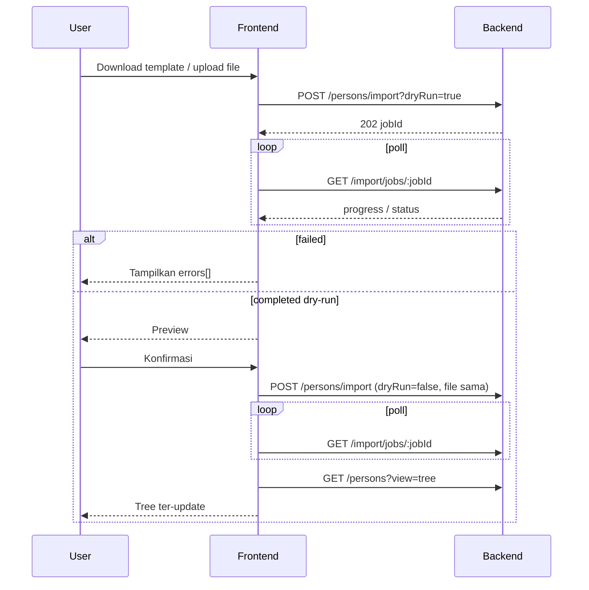

# Persons Import API — Job queue + progress (v1)

Bulk import anggota keluarga agar **sekalian membentuk tree graph** (ayah, ibu, pasangan; anak otomatis dari parent link).

**Base URL (dev):** `http://localhost:3000`  
**Prefix API:** `/api/v1`  
**Auth:** Bearer JWT (wajib)  
**AuthZ:** hanya `role=admin` family (template boleh semua user login)  
**Scope:** `familyId` dari JWT

Related:

- [`PERSONS-IMPORT-FE-PROMPT.md`](../../prompts/PERSONS-IMPORT-FE-PROMPT.md) — prompt siap tempel untuk pengerjaan FE
- [`FE-API-INTEGRATION.md`](../../guides/FE-API-INTEGRATION.md) — persons list/tree/CRUD
- [`persons-import-template.csv`](../../templates/persons-import-template.csv)
- [`persons-import-example.csv`](../../templates/persons-import-example.csv)
- [`persons-import-example.json`](../../templates/persons-import-example.json)

---

## 1. Keputusan produk (v1)

| Topik | Keputusan |
|-------|-----------|
| Eksekusi | **Async job** — `POST` langsung `202` + `jobId` |
| Queue | **In-process** (otomatis bareng API, tanpa `queue:work`) |
| Progress ke FE | **Polling** `GET /persons/import/jobs/:jobId` |
| Format | CSV (utama) + JSON |
| Anak | Tidak ada kolom children — isi `fatherTempId` / `motherTempId` di baris anak |
| Error validasi | Job `status=failed` + `errors[]` (bukan HTTP 400 setelah job jalan) |
| Dry-run | `dryRun=true` → validasi + preview, **tanpa** write persons |
| Atomic commit | Gagal di tengah simpan → soft-delete yang sudah terlanjur dibuat |
| Max rows | **200** |
| Max file | **2 MB** |
| Foto | Tidak di v1 |

### Status job

`queued` → `validating` → (`importing` jika commit) → `completed` | `failed`

---

## 2. Endpoints

### 2.1 Download template

```
GET /api/v1/persons/import/template
Authorization: Bearer <token>
→ 200 text/csv
```

### 2.2 Enqueue import

```
POST /api/v1/persons/import?dryRun=true|false
Authorization: Bearer <token>
```

**Opsi A — multipart**

```
Content-Type: multipart/form-data
file: <csv|json>
dryRun: true   (opsional; boleh di query)
```

**Opsi B — JSON body**

```json
{
  "dryRun": true,
  "persons": [
    {
      "tempId": "ayah",
      "fullName": "Budi Widodo",
      "gender": "male",
      "birthDate": "1975-01-15",
      "spouseTempIds": ["ibu"]
    }
  ]
}
```

**Response `202`**

```json
{
  "data": {
    "jobId": "imp_a1b2c3d4e5f6a7b8c9d0e1f2",
    "status": "queued",
    "dryRun": true,
    "format": "csv",
    "progress": { "percent": 0, "processed": 0, "total": 8 },
    "message": "Menunggu antrian…",
    "errors": [],
    "result": null,
    "createdAt": "2026-07-25T06:00:00.000Z",
    "startedAt": null,
    "finishedAt": null
  }
}
```

### 2.3 Poll progress

```
GET /api/v1/persons/import/jobs/:jobId
Authorization: Bearer <token>
```

Poll tiap **800–1500 ms** sampai `status` ∈ `completed` | `failed`.

Contoh progress:

```json
{
  "data": {
    "jobId": "imp_…",
    "status": "importing",
    "dryRun": false,
    "format": "csv",
    "progress": { "percent": 62, "processed": 5, "total": 8 },
    "message": "Menyimpan persons (5/8)…",
    "errors": [],
    "result": null,
    "createdAt": "…",
    "startedAt": "…",
    "finishedAt": null
  }
}
```

**Completed (dry-run)**

```json
{
  "data": {
    "jobId": "imp_…",
    "status": "completed",
    "dryRun": true,
    "progress": { "percent": 100, "processed": 8, "total": 8 },
    "message": "Dry-run selesai. Data valid.",
    "errors": [],
    "result": {
      "dryRun": true,
      "rowCount": 8,
      "createdCount": 0,
      "idByTempId": {},
      "preview": [
        {
          "tempId": "anak1",
          "fullName": "Dimas Widodo",
          "gender": "male",
          "birthDate": "2000-04-21",
          "fatherTempId": "ayah",
          "motherTempId": "ibu",
          "spouseTempIds": [],
          "fatherId": null,
          "motherId": null,
          "spouseIds": []
        }
      ],
      "persons": []
    },
    "finishedAt": "…"
  }
}
```

**Completed (commit)**

```json
{
  "data": {
    "status": "completed",
    "dryRun": false,
    "progress": { "percent": 100, "processed": 8, "total": 8 },
    "message": "Import selesai. 8 person ditambahkan.",
    "result": {
      "dryRun": false,
      "rowCount": 8,
      "createdCount": 8,
      "idByTempId": { "ayah": 103, "ibu": 104, "anak1": 106 },
      "preview": ["…"],
      "persons": [
        {
          "id": 106,
          "tempId": "anak1",
          "fullName": "Dimas Widodo",
          "fatherId": 103,
          "motherId": 104,
          "spouseIds": []
        }
      ]
    }
  }
}
```

**Failed (validasi)**

```json
{
  "data": {
    "status": "failed",
    "progress": { "percent": 100, "processed": 8, "total": 8 },
    "message": "Validasi gagal.",
    "errors": [
      {
        "row": 7,
        "tempId": "anak1",
        "field": "fatherTempId",
        "message": "fatherTempId \"ayahx\" tidak ditemukan di file."
      }
    ],
    "result": null
  }
}
```

Setelah commit sukses → refresh tree:

```
GET /api/v1/persons?view=tree
```

---

## 3. Skema row (CSV / JSON)

### Wajib

`tempId`, `fullName`, `gender` (`male`|`female`), `birthDate` (`YYYY-MM-DD`)

### Relasi tree

| Field | Keterangan |
|-------|------------|
| `fatherTempId` / `motherTempId` | Ref ke `tempId` dalam file |
| `spouseTempIds` | CSV: pipe `\|` ; JSON: `string[]` |
| `fatherId` / `motherId` / `spouseIds` | Opsional — person **existing** di family |

Jangan isi `fatherTempId` + `fatherId` bersamaan (sama untuk ibu).  
Jangan sediakan kolom `children`.

CSV header resmi = isi `GET /import/template` / `docs/templates/persons-import-template.csv` (lihat folder templates).

---

## 4. Flow FE



User **tidak** perlu tahu validasi/insert/link — cukup progress bar dari `progress.percent` + `message`.

---

## 5. Error codes (sync, sebelum/saat enqueue)

| Code | HTTP | Kapan |
|------|------|--------|
| `PERSON_IMPORT_FORBIDDEN` | 403 | Bukan admin |
| `PERSON_IMPORT_TOO_LARGE` | 400 | >200 rows / file >2MB |
| `PERSON_IMPORT_UNSUPPORTED_FORMAT` | 400 | Bukan CSV/JSON valid |
| `PERSON_IMPORT_VALIDATION_FAILED` | 400 | Payload kosong / tidak dikenali |
| `PERSON_IMPORT_JOB_NOT_FOUND` | 404 | jobId salah / beda family |
| `UNAUTHORIZED` | 401 | Token invalid |

Error **per-baris** setelah job jalan → lihat `data.errors` pada poll (`status=failed`).

---

## 6. TypeScript (FE)

```ts
export type PersonImportJobStatus =
  | 'queued'
  | 'validating'
  | 'importing'
  | 'completed'
  | 'failed';

export type PersonImportJobResponse = {
  jobId: string;
  status: PersonImportJobStatus;
  dryRun: boolean;
  format: 'csv' | 'json';
  progress: { percent: number; processed: number; total: number };
  message: string | null;
  errors: Array<{ row: number; tempId?: string; field?: string; message: string }>;
  result: {
    dryRun: boolean;
    rowCount: number;
    createdCount: number;
    idByTempId: Record<string, number>;
    preview: Array<{
      tempId: string;
      fullName: string;
      gender: 'male' | 'female';
      birthDate: string;
      fatherTempId: string | null;
      motherTempId: string | null;
      spouseTempIds: string[];
      fatherId: number | null;
      motherId: number | null;
      spouseIds: number[];
    }>;
    persons: Array<{
      id: number;
      tempId: string;
      fullName: string;
      fatherId: number | null;
      motherId: number | null;
      spouseIds: number[];
    }>;
  } | null;
  createdAt: string;
  startedAt: string | null;
  finishedAt: string | null;
};
```

---

## 7. Ops / BE notes

- Worker in-process: `enqueuePersonImportJob` + `recoverPersonImportJobs` saat boot.
- Job `validating`/`importing` yang nyangkut karena restart → di-mark `failed` (user upload ulang).
- Job `queued` yang belum ke-proses → di-requeue saat boot.
- Tabel: `person_import_jobs` (migration `20260725120000_create_person_import_jobs.ts`).

---

## 8. Status

| Layer | Status |
|-------|--------|
| Template CSV/JSON | ✅ |
| Migration + worker + endpoints | ✅ |
| FE prompt | ✅ [`PERSONS-IMPORT-FE-PROMPT.md`](../../prompts/PERSONS-IMPORT-FE-PROMPT.md) |
| Postman | ⏳ opsional |
